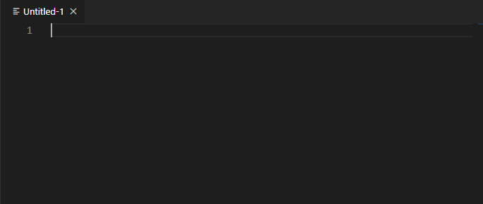
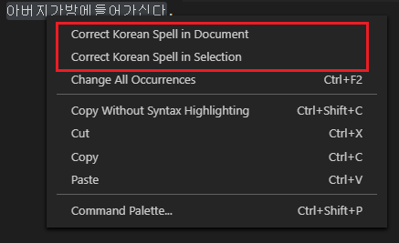

# 한국어 맞춤법 검사기

이 확장 프로그램은 한국어 맞춤법 검사기입니다.

## 기능

선택된 텍스트 혹은 전체 문서에서 **한국어 문법**을 교정할 수 있습니다.

## 설치

이 확장 프로그램을 설치하려면 `보기->확장` 메뉴로 이동 후 `Speller for Korean` 검색합니다. 그리고 설치를 클릭 후 창을 다시 로드하면 됩니다.

## 사용법

이 확장 프로그램을 사용하려면 명령 팔레트(macOS는 `Cmd+Shift+P`, Windows는 `Ctrl+Shift+P`)로 이동하여 `Speller-Korean: Correct Selection or Document` 명령어를 실행합니다.
> 단축키 `Shift+Alt+K` 를 사용할 수 있습니다.

또는 상황에 맞는 메뉴(에디터에서 마우스 우 클릭)에서 `Correct Korean Spell in Document`를 선택합니다.
> 텍스트가 선택(단일 또는 다중)되어 있다면 `Correct Korean Spell in Selection` 메뉴 항목을 볼 수 있습니다.

## 확장 프로그램 설정

현재는 제공되는 설정이 없습니다.

## 이슈

이 확장 프로그램을 사용하는 중에 문제를 발견하거나 새로운 기능을 제안하길 원하신다면,
부담 없이 [Github](https://github.com/phoihos/vscode-speller-korean/issues)에 이슈를 등록해주세요.

## 릴리스 정보

상세한 릴리스 정보는 [여기](https://github.com/phoihos/vscode-speller-korean/blob/master/CHANGELOG.md) 또는 상단의 **변경 로그** 탭에서 확인 가능합니다.

## API supported by

https://search.naver.com/search.naver?sm=top_hty&fbm=1&ie=utf8&query=네이버+맞춤법+검사기

-----------------------------------------------------------------------------

# Speller for Korean

This extension is a spell checker for korean.

## Features

You can correct **Korean Spell** in selected text or whole document.

## Installation

To install this extension go to `View->Extensions` and search for `Speller for Korean`. Next click Install and then Reload.

## Usage

To use the extension go to the Command Palette (`Cmd+Shift+P` on macOS or `Ctrl+Shift+P` on Windows) and launch `Speller-Korean: Correct Selection or Document` command.
> You can use keyboard shortcut `Shift+Alt+K`.

Or select `Correct Korean Spell in Document` from context menu (`Right-click` on editor).
> You can see also `Correct Korean Spell in Selection` menu item when you select some text (single or multi select).

## Settings

Currently, there is no settings.

## Issues

If you find any problems using this extension or you want to propose new features to it, feel free to open an issue on [Github](https://github.com/phoihos/vscode-speller-korean/issues).

## Release Notes

Detailed Release Notes are available [here](https://github.com/phoihos/vscode-speller-korean/blob/master/CHANGELOG.md) or above **Changelog** tab.

## API supported by

https://search.naver.com/search.naver?sm=top_hty&fbm=1&ie=utf8&query=네이버+맞춤법+검사기
